<p align="center">
  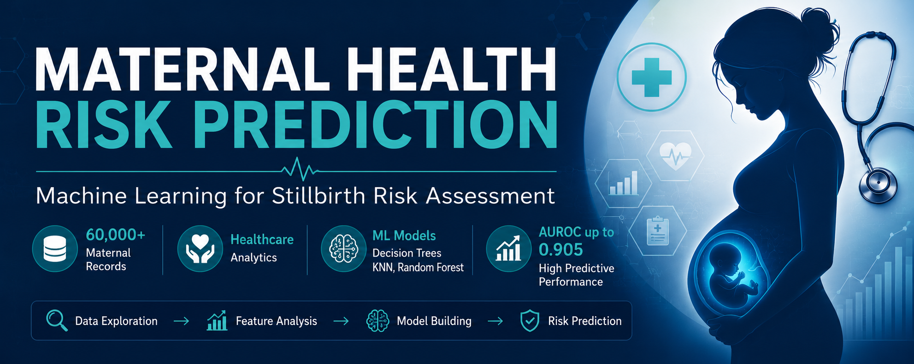
</p>

# Maternal & Neonatal Outcome Prediction using Machine Learning

## Overview

This project applies machine learning techniques to predict maternal and neonatal birth outcomes using healthcare facility delivery records collected from Kenya and Uganda.

The objective is to identify factors associated with adverse pregnancy outcomes and evaluate the effectiveness of machine learning models in predicting birth outcomes. The project combines healthcare analytics, exploratory data analysis, feature engineering, class imbalance handling, and predictive modeling to support data-driven healthcare decision-making.

---

## Key Project Metrics

| Metric | Value |
|----------|----------|
| Records Analysed | 61,018 |
| Countries | Kenya & Uganda |
| Features Used | 13 |
| Machine Learning Models | 4 |
| Best Model | Random Forest |
| Best AUROC | 0.905 |

---

## Business Problem

Maternal and neonatal mortality remain major public health challenges in many low-resource regions.

Healthcare providers require reliable methods to identify pregnancies at higher risk of adverse outcomes so that preventative interventions can be implemented earlier.

This project investigates whether machine learning models can accurately predict birth outcomes using maternal characteristics, gestational information, and neonatal indicators.

---

## Dataset Information

### Source

Healthcare facility delivery records collected from:

- Kenya
- Uganda

### Dataset Size

- 61,018 delivery records
- Originally 22 attributes
- Reduced to 13 key predictive features after preprocessing

### Key Variables

| Feature | Description |
|----------|------------|
| Country | Delivery country |
| Referral Status | Hospital referral information |
| Sex | Baby sex |
| Multiple Birth | Multiple delivery indicator |
| Abortion History | Documented abortion indicator |
| IUFD | Intrauterine fetal demise indicator |
| Mother's Age Category | Maternal age groups |
| Gestational Age Category | Pregnancy duration categories |
| Birth Weight | Neonatal birth weight |
| Birth Outcome | Born Alive / Still Birth |

---

# Project Workflow

```text
Raw Healthcare Data
        ↓
Data Cleaning
        ↓
Missing Value Treatment
        ↓
Feature Engineering
        ↓
Exploratory Data Analysis
        ↓
Class Imbalance Handling (SMOTE)
        ↓
Model Training
        ↓
Model Evaluation
        ↓
Healthcare Insights
```

---

# Exploratory Data Analysis

## Missing Value Assessment

Understanding missing data patterns was critical before model development.

<p align="center">
  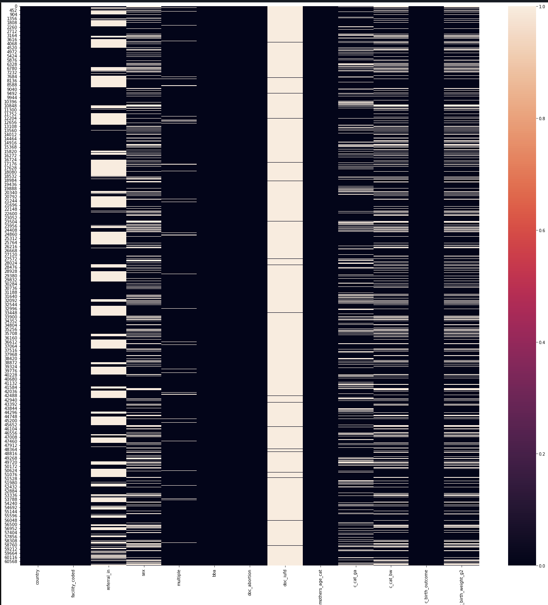
</p>

### Key Findings

- Missing values were concentrated within specific healthcare variables.
- Missing records were addressed through preprocessing and data cleaning.
- Data quality assessment improved the reliability of subsequent analysis.

---

## Maternal Age vs Birth Outcome

<p align="center">
  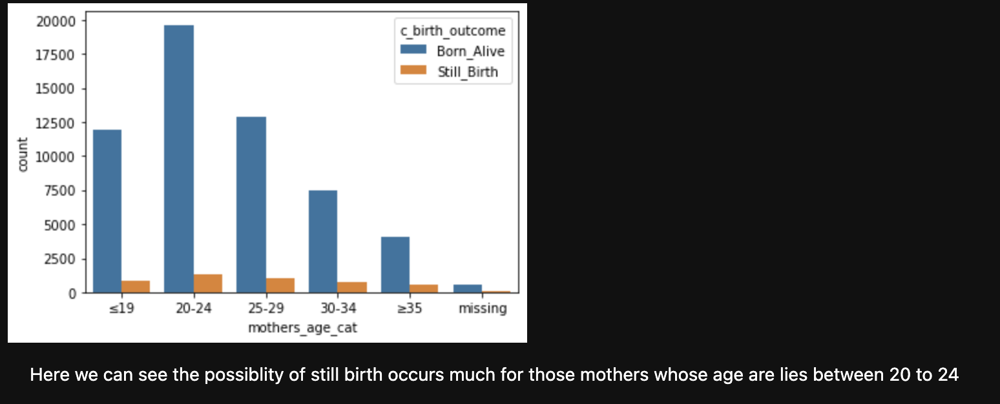
</p>

### Key Findings

- Most deliveries occurred among mothers aged 20–24 years.
- The largest number of stillbirths was observed within the same age group due to higher birth volume.
- Maternal age demonstrated a measurable relationship with birth outcomes.

---

## Gestational Age vs Birth Outcome

<p align="center">
  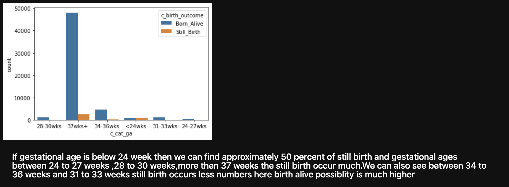
</p>

### Key Findings

- Full-term pregnancies (37+ weeks) accounted for the majority of live births.
- Extremely premature pregnancies showed substantially higher stillbirth rates.
- Gestational age emerged as one of the strongest predictors of birth outcome.

---

# Birth Weight Analysis

## Birth Weight Distribution

<p align="center">
  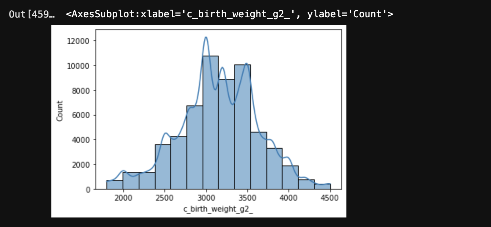
</p>

### Key Findings

- Birth weight follows an approximately normal distribution.
- Most newborns were born within healthy weight ranges.
- Lower birth weights were associated with adverse birth outcomes.

---

## Birth Weight by Sex

<p align="center">
  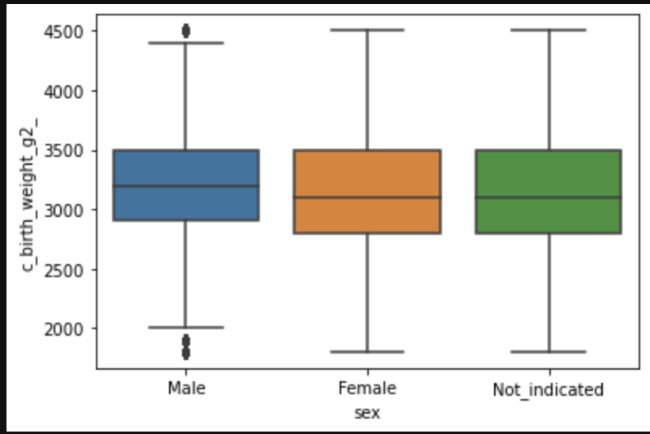
</p>

### Key Findings

- Male newborns showed slightly higher median birth weights.
- Birth weight distributions remained relatively consistent across sex categories.

---

## Birth Weight by Gestational Age and Sex

<p align="center">
  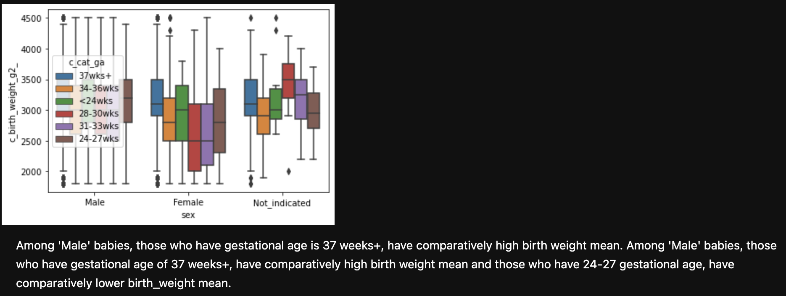
</p>

### Key Findings

- Birth weight generally increased with gestational age.
- Full-term births had the highest median birth weights.
- This relationship remained consistent across sex categories.

---

## Birth Weight by Maternal Age and Abortion History

<p align="center">
  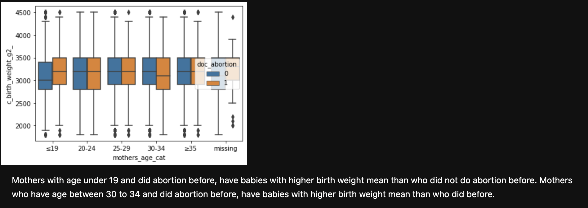
</p>

### Key Findings

- Maternal characteristics demonstrated varying relationships with neonatal birth weight.
- Historical pregnancy factors contributed additional predictive information.

---

# Feature Selection

## Correlation Analysis

<p align="center">
  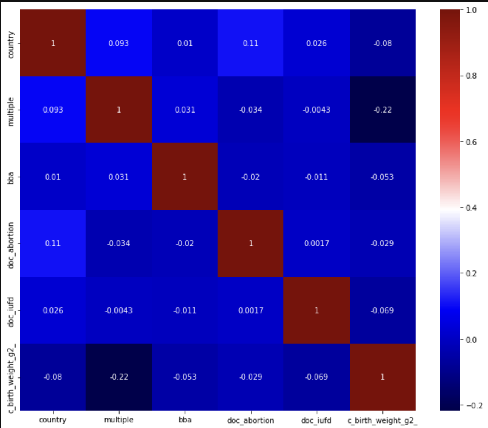
</p>

### Key Findings

- Gestational age and birth weight showed meaningful predictive relationships.
- Correlation analysis helped identify informative variables for model development.
- Low-value predictors were removed during feature selection.

---

# Handling Class Imbalance

The dataset exhibited significant class imbalance.

| Birth Outcome | Approximate Distribution |
|--------------|--------------------------|
| Born Alive | 93% |
| Still Birth | 7% |

To address this challenge:

- SMOTE (Synthetic Minority Oversampling Technique) was applied.
- Minority class representation was increased.
- Model sensitivity toward stillbirth prediction improved substantially.

---

# Machine Learning Models

The following models were evaluated:

### Baseline

- ZeroR

### Supervised Learning Models

- Decision Tree
- K-Nearest Neighbours (KNN)
- Random Forest

---

# Decision Tree Optimization

## Max Depth Tuning

<p align="center">
  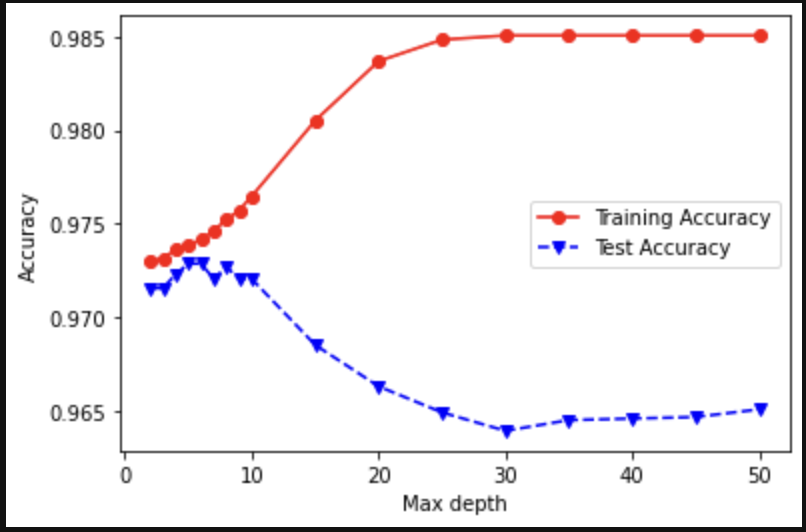
</p>

### Key Findings

- Training accuracy increased with tree depth.
- Test accuracy peaked at moderate depth values.
- Larger depths introduced overfitting.

---

# Decision Tree Performance

## Baseline Decision Tree Confusion Matrix

<p align="center">
  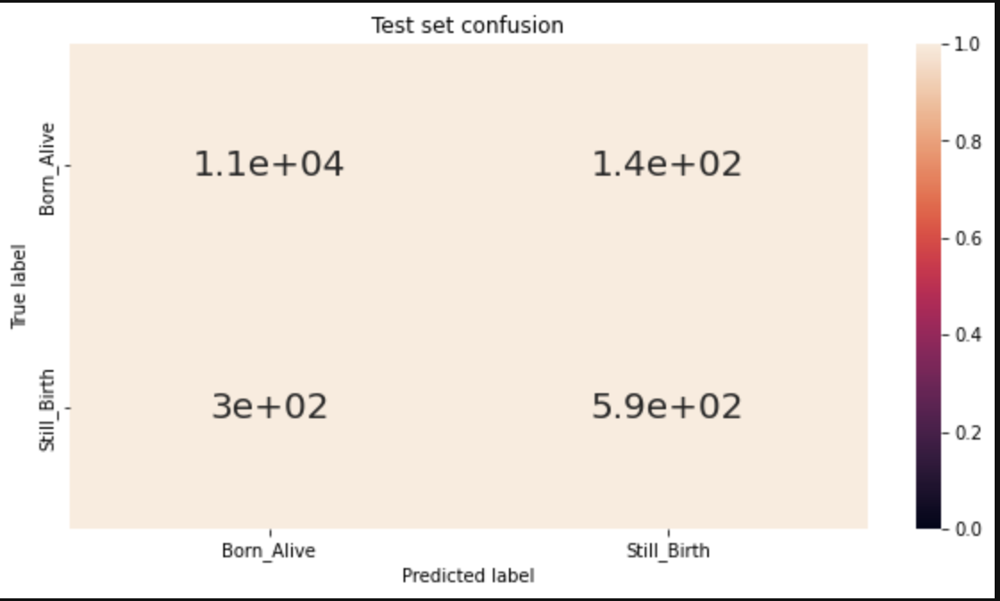
</p>

### Key Findings

- Decision Tree established a strong baseline model.
- Performance improved after class balancing techniques were introduced.
- The model successfully captured important healthcare outcome patterns.

---

# Random Forest Performance

## Random Forest Test Confusion Matrix

<p align="center">
  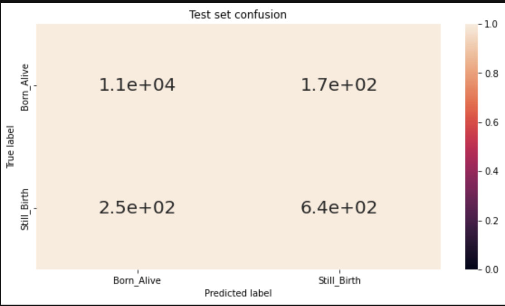
</p>

### Key Findings

- Random Forest achieved the strongest overall predictive performance.
- The model improved stillbirth detection compared with simpler approaches.
- Ensemble learning reduced overfitting while maintaining high accuracy.

---

# Model Comparison

## AUROC Comparison

<p align="center">
  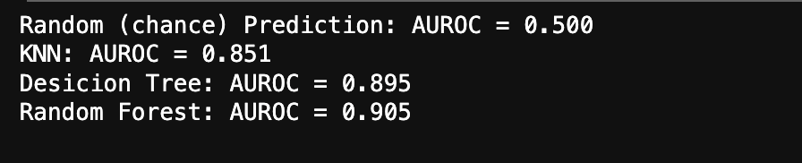
</p>

| Model | AUROC |
|---------|---------|
| Random Prediction | 0.500 |
| KNN | 0.851 |
| Decision Tree | 0.895 |
| Random Forest | 0.905 |

---

# Results Summary

| Model | Performance Summary |
|---------|---------|
| ZeroR | Baseline benchmark |
| Decision Tree | Strong classification performance |
| KNN | Competitive predictive capability |
| Random Forest | Best overall model |

### Best Model

🏆 **Random Forest**

Performance Highlights:

- Highest AUROC score (0.905)
- Improved stillbirth detection
- Better generalisation performance
- Reduced overfitting risk

---

# Technologies Used

### Programming

- Python

### Data Analysis

- Pandas
- NumPy

### Machine Learning

- Scikit-Learn
- SMOTE

### Data Visualisation

- Matplotlib
- Seaborn

### Development Environment

- Jupyter Notebook

---

# Repository Structure

```text
Maternal-Neonatal-Outcome-Prediction/
│
├── data/
│
├── notebooks/
│   └── Maternal_Neonatal_Outcome_Prediction.ipynb
│
├── reports/
│   └── Project_Report.pdf
│
├── visuals/
│   ├── repository_banner.png
│   ├── missing_values_heatmap.png
│   ├── maternal_age_vs_birth_outcome.png
│   ├── gestational_age_vs_birth_outcome.png
│   ├── birth_weight_distribution.png
│   ├── birth_weight_by_sex.png
│   ├── birth_weight_by_gestational_age_and_sex.png
│   ├── birth_weight_by_maternal_age_and_abortion_history.png
│   ├── feature_correlation_heatmap.png
│   ├── decision_tree_baseline_confusion_matrix.png
│   ├── decision_tree_max_depth_accuracy.png
│   ├── random_forest_test_confusion_matrix.png
│   └── model_auroc_comparison.png
│
├── requirements.txt
├── README.md
└── LICENSE
```

---

# Future Improvements

- XGBoost implementation
- LightGBM implementation
- SHAP explainability analysis
- Advanced feature engineering
- Cross-validation framework
- Healthcare risk scoring dashboard
- Deployment as an interactive web application

---

# Why This Project Matters

Stillbirth remains a significant healthcare challenge globally, particularly in resource-constrained settings.

This project demonstrates how machine learning can transform healthcare data into actionable insights, helping clinicians and healthcare providers identify risk factors earlier and support evidence-based maternal care strategies.

---

## Author

### Muntasir Md Nafis

LinkedIn: [www.linkedin.com/in/muntasirmdnafis](https://www.linkedin.com/in/muntasir-md-nafis/)